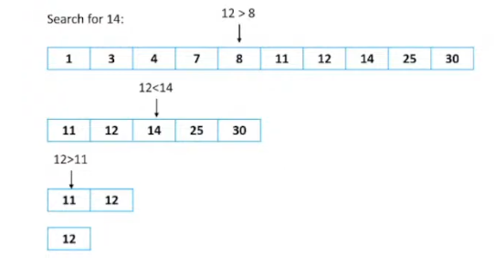

# Busca Binária

Busca elementos de acordo com uma ordenação (crescente ou decrescente).


### Vantagem
Uma busca linear (começa do início olhando todos os elementos e acaba a busca quando achar o elemento desejado). O pior caso seria O(n), ou seja, olhar todos os elementos.

````
// algoritmo linear de busca (sem busca binária)
int v[100];
int n;
cin >> n;

for(int i = 0; i < n; i++){
    cin >> v[i];
}

// tentando encontrar o número 14
for(int i = 0; i < n; i++){
    if(v[i] == 14){
        cout << "14 está no array\n";
        return 0;
    }
}
cout << "14 não está no array\n";
````

````
// código da busca binária
int busca(int x){
    int l = 0, r  = n - 1, mid;  // l = esquerda (início), r = direita (fim), mid = meio 

    while(l <= r){
        mid = (l + r)/2;
        if(v[mid] == x) return mid;
        if(v[mid] > x){
            r = mid - 1;
        }else{
            l = mid + 1;
        }
    }
    return -1; 
}
````

E caso a gente queira os índices originais do elemento no vetor?<br>
Podemos fazer um vetor de pair.<br>

````
pair<int, int>
// o primeiro elemento pode guardar o valor do elemento.
// o segundo elemento pode guardar a posição do elemento.
````

### Complexidade da busca binária
Logarítmica: O(log n).