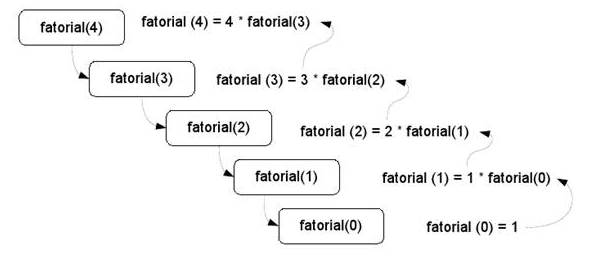
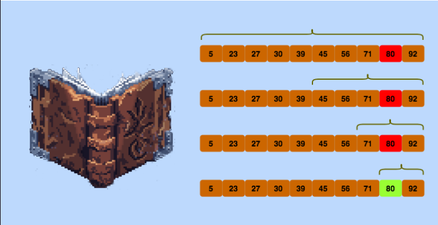

# Recursividade
Recursividade é um conceito fundamental na programação, onde uma função é capaz de chamara si mesma durante sua execução. É frequentemente utilizada para resolver problemas que podem ser subdivididos em casos menores e mais simples.



## Fatorial recursivo
Neste exemplo, a função fatorial() chama a si mesma com um argumento reduzido em 1 até que atinja o caso base (quando n é 0 ou 1). Isso cria uma cadeia de chamadas de função que eventualmente se reduz ao caso base e, em seguida, retorna valores até a chamada original.
````
#include<iostream>
using namespace std;

int fatorial(int n){
    if(n == 0 || n == 1)
        return 1;
    else
        return n * fatorial(n - 1);            
}

int main(){
    int n;
    cin >> n;

    cout << fatorial(n) << endl;
}
````

# Busca binária
A busca binária é um agoritmo eficiente para encontrar um determinado elemento em uma lista ordenada. Ele funciona dividindo repetidamente a lista pela metade e descartando a metade onde certamente não está o elemento procurado



````
int buscaBinaria(vector<int> &evt, int target, bool first){
    int l = 0, r = (int)nums.size()-1;
    int ans = -1;

    while(l <= r){
        int mid = (l + r) / 2;
        
        if(nums[mid] == target){
            ans = mid;
            if(first){
                r = mid - 1;
            }else{
                l = mid + 1;
            }      
        }else if(nums[mid] < target){
            l = mid + 1;
        }else{
            r = mid - 1;
        }
    }
    return ans;
} 
````

## Busca binária recursiva

````
int buscaBinaria(vector<int>& array, int alvo, int esquerda, int direita){
    if(direita >= esquerda){
        int meio = esquerda + (direita - esquerda) / 2;
        if(array[meio] == alvo)
            return meio;
        
        // se o alvo for menor, vai para a esquerda:
        if(array[meio > alvo])
            return buscaBinaria(array, alvo, esquerda, meio - 1);

        // se o alvo for maior, vai para a direita:
        return buscaBinaria(array, alvo, meio + 1, direita);
    }

    // elemento não encontrado
    return -1;
}
````

# Exponenciação Binária
A exponenciação binária, também conhecida como exponenciação por quadrados, é um método utilizado para calcular eficientemente grandes potências de um número. É particularmente útil em algoritmos que envolvem aritmética modular e em diversos cálculos matemáticos.<br>
A ideia básica por trás da exponenciação binária é reduziro número de multiplicações necessárias para calcular uma potência, dividindo o expoente em sua representação binária. Então, aproveitando as propriedades da exponenciação e do quadrado, você pode calcular o resultado com menos multiplicações.

3¹ = 3<br>
3² = (3¹)² = 3² = 9<br>
3⁴ = (3²)² = 9² = 81<br>
3⁸ = (3⁴)² = 81² = 6561<br>

````
#include<iostream>
#include<map>
using namespace std;

int exponenciacao(int base, int exp, int x){
    if(exp == 0)
        return 1;
    
    int metade = exponenciacao(base, exp/2);
    if(exp % 2 == 0){
        return (metade * metade) % x;
    }else{
        return metade * metade * base;
    }
}
````
